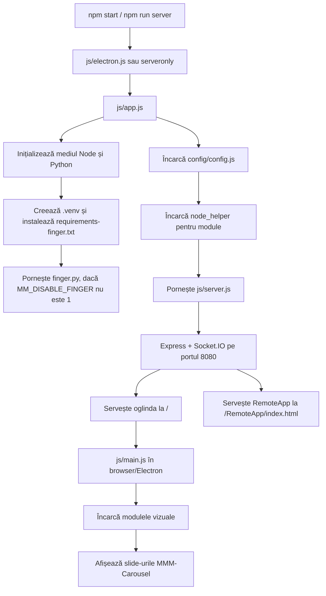
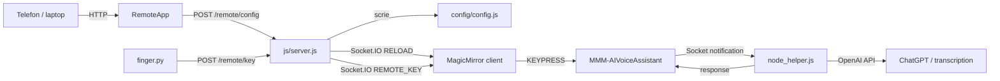
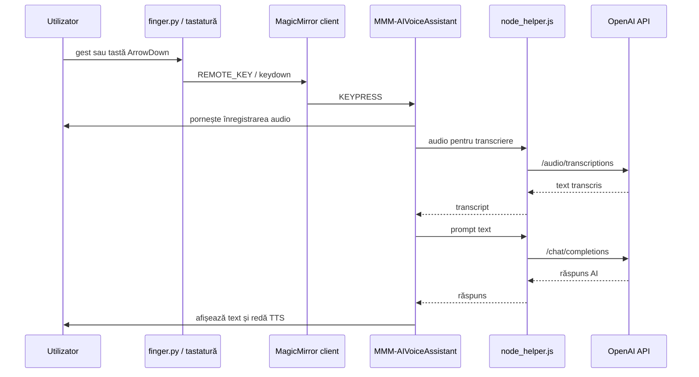

# IntelliGlass Krontech

IntelliGlass este o aplicație de smart mirror construită peste MagicMirror, adaptată pentru Raspberry Pi 4, control prin gesturi, configurare din telefon și asistent vocal AI. Aplicația afișează module clasice de oglindă inteligentă - ceas, calendar, vreme, știri, complimente - și adaugă două componente custom importante:

- `RemoteApp`: interfața web de configurare accesibilă din rețea.
- `MMM-AIVoiceAssistant`: modulul de asistent vocal, numit în configurare `Jarvis`.
- `finger.py`: controllerul de gesturi cu cameră, OpenCV/Picamera2 și MediaPipe.

Proiectul este încă un MagicMirror complet, deci păstrează serverul Express, clientul Electron, sistemul de module, Socket.IO și testele upstream.

## Cuprins

- [Flow-ul aplicației](#flow-ul-aplicației)
- [Arhitectură](#arhitectură)
- [Module active](#module-active)
- [RemoteApp](#remoteapp)
- [Asistentul AI](#asistentul-ai)
- [Control prin gesturi](#control-prin-gesturi)
- [Endpoint-uri server](#endpoint-uri-server)
- [Instalare](#instalare)
- [Rulare](#rulare)
- [Configurare](#configurare)
- [Variabile de mediu](#variabile-de-mediu)
- [Testare și verificări](#testare-și-verificări)
- [Structura proiectului](#structura-proiectului)
- [Note de securitate](#note-de-securitate)

## Flow-ul aplicației

Flow-ul principal pornește din `package.json`, trece prin Electron, apoi prin serverul MagicMirror și modulele configurate.



Pe scurt:

1. `npm start` pornește Electron în modul Wayland, potrivit pentru Raspberry Pi.
2. `js/electron.js` pornește core-ul aplicației și deschide fereastra full-screen.
3. `js/app.js` pregătește runtime-ul, pornește `finger.py`, citește configurația și încarcă modulele.
4. `js/server.js` deschide serverul HTTP, servește fișierele statice și expune API-urile RemoteApp.
5. Clientul MagicMirror încarcă `js/main.js`, modulele și conexiunea Socket.IO.
6. RemoteApp poate modifica `config/config.js`, apoi serverul emite `RELOAD` către oglindă.

## Arhitectură

Aplicația are patru zone majore:

| Zonă             | Rol                                                                                                                 |
| ---------------- | ------------------------------------------------------------------------------------------------------------------- |
| Core MagicMirror | Server Express, Electron, loader de module, sistem de notificări și Socket.IO.                                      |
| Config           | `config/config.js` decide portul, limba, modulele, pozițiile și setările fiecărui modul.                            |
| RemoteApp        | Panou web pentru configurare vreme, calendar, RSS, complimente, locale și asistent AI.                              |
| Gesture/AI       | `finger.py` trimite taste remote, iar `MMM-AIVoiceAssistant` ascultă, transcrie, întreabă OpenAI și redă răspunsul. |



## Module active

Configurația curentă activează următoarele module:

- `alert`: afișează notificări vizuale.
- `updatenotification`: verifică actualizări MagicMirror.
- `clock`: ceasul din oglindă.
- `calendar`: calendar Google prin URL iCal.
- `compliments`: mesaje personalizate pe intervale ale zilei.
- `weather`: vreme curentă și prognoză prin `openmeteo`, configurate pe Brașov.
- `newsfeed`: fluxuri RSS, momentan Ziare.com și Brașov Știri.
- `MMM-KeyBindings`: transformă tastele în notificări pentru module.
- `MMM-AIVoiceAssistant`: asistent vocal AI.
- `MMM-QRCode`: afișează QR către configuratorul RemoteApp.
- `MMM-Carousel`: împarte oglinda în slide-uri navigabile.

Slide-urile carousel sunt:

| Slide     | Module                                        |
| --------- | --------------------------------------------- |
| `main`    | `clock`, `weather`, `compliments`, `calendar` |
| `Slide 2` | `newsfeed`                                    |
| `Slide 3` | `MMM-AIVoiceAssistant`                        |
| `Slide 4` | `MMM-QRCode`                                  |

## RemoteApp

RemoteApp este panoul de control web din folderul `RemoteApp`. Este servit de MagicMirror la:

```text
http://<ip-raspberry-pi>:8080/RemoteApp/index.html
```

În oglindă apare și un QR code care trimite către această adresă.

Flow-ul RemoteApp:

1. Utilizatorul deschide `RemoteApp/index.html`.
2. Aplicația detectează hostul curent sau folosește hostul salvat în `localStorage`.
3. La conectare, RemoteApp cheamă `GET /remote/status`.
4. Dacă serverul răspunde, RemoteApp marchează oglinda ca online.
5. RemoteApp citește configurația curentă cu `GET /config`.
6. Interfața completează câmpurile pentru vreme, calendar, RSS, complimente, locale și AI.
7. La salvare, RemoteApp trimite `POST /remote/config`.
8. Serverul validează payload-ul, rescrie bucăți din `config/config.js` și emite `RELOAD` prin Socket.IO.
9. Clientul MagicMirror primește `RELOAD` și se reîncarcă.

Paginile RemoteApp:

| Pagină           | Rol                                                     |
| ---------------- | ------------------------------------------------------- |
| `index.html`     | Status general, conectare la oglindă și sumar surse.    |
| `weather.html`   | Coordonate meteo și preseturi pentru orașe din România. |
| `news.html`      | Două feed-uri RSS configurabile.                        |
| `calendar.html`  | URL calendar iCal și complimente.                       |
| `assistant.html` | Model OpenAI, STT, activare, prompt, UI și TTS.         |
| `network.html`   | IP, URL RemoteApp și numărul de clienți conectați.      |
| `settings.html`  | Limbă și format oră.                                    |

## Asistentul AI

Modulul `MMM-AIVoiceAssistant` este un modul MagicMirror custom aflat în:

```text
modules/MMM-AIVoiceAssistant
```

Flow-ul asistentului:



Caracteristici:

- Activarea curentă este `ArrowDown`.
- Poate asculta notificări de la `MMM-KeyBindings`.
- Poate folosi fallback direct din keyboard event.
- STT poate fi `auto`, `browser` sau `openai`.
- Pe Raspberry Pi este recomandat `sttEngine: "openai"`.
- Răspunsurile vin prin endpoint-ul OpenAI compatibil `/v1/chat/completions`.
- TTS poate fi browser-based sau sistemic, cu `espeak-ng`.
- UI-ul poate fi configurat din RemoteApp: temă, font, dimensiune, transcript, timeout-uri, prompturi.

Notă: `config/config.js` conține câmpuri pentru `calendarIntegration` și `mirrorContextEnabled`, dar implementarea verificată a modulului AI folosește efectiv OpenAI pentru STT/chat/TTS și nu consumă direct acea integrare calendaristică în `node_helper.js`.

## Control prin gesturi

`finger.py` pornește odată cu aplicația, dacă `MM_DISABLE_FINGER` nu este setat la `1`.

Folosește:

- OpenCV sau Picamera2 pentru cameră.
- MediaPipe Hands pentru detectarea mâinii.
- Un mecanism de stabilizare pe câteva frame-uri înainte de a trimite acțiunea.
- Endpoint-ul `POST /remote/key` pentru a livra taste către clientul MagicMirror.
- Fallback prin taste native pe macOS/Linux, dacă endpoint-ul remote nu funcționează și fallback-ul este permis.

Gesturi mapate:

| Gest detectat                  | Acțiune               |
| ------------------------------ | --------------------- |
| Un deget în stânga frame-ului  | `ArrowLeft`           |
| Un deget în dreapta frame-ului | `ArrowRight`          |
| Două degete în partea de sus   | `ArrowUp`             |
| Două degete în partea de jos   | `ArrowDown`           |
| Patru degete                   | setează starea `Play` |
| Pumn după starea `Play`        | `Space`               |

În configurația carousel, `ArrowLeft` și `ArrowRight` navighează între slide-uri, iar `ArrowDown` este legat de slide-ul asistentului și de activarea AI.

## Endpoint-uri server

Serverul principal este în `js/server.js`.

| Endpoint                | Metodă | Rol                                                                                 |
| ----------------------- | ------ | ----------------------------------------------------------------------------------- |
| `/`                     | `GET`  | Servește interfața MagicMirror.                                                     |
| `/RemoteApp/*`          | `GET`  | Servește configuratorul web.                                                        |
| `/config`               | `GET`  | Returnează configurația curentă, redacted dacă `hideConfigSecrets` este activ.      |
| `/remote/status`        | `GET`  | Returnează status, timestamp și număr de clienți Socket.IO.                         |
| `/remote/source-health` | `POST` | Verifică disponibilitatea URL-urilor RSS și calendar.                               |
| `/remote/command`       | `POST` | Acceptă `reload` sau `apply_all` și emite `RELOAD`.                                 |
| `/remote/key`           | `POST` | Acceptă taste permise și emite `REMOTE_KEY`.                                        |
| `/remote/config`        | `POST` | Actualizează vreme, calendar, RSS, complimente, locale și AI în `config/config.js`. |
| `/reload`               | `GET`  | Emite `RELOAD` către clienți.                                                       |
| `/version`              | `GET`  | Returnează versiunea MagicMirror.                                                   |
| `/startup`              | `GET`  | Returnează data pornirii serverului.                                                |

## Instalare

Cerințe:

- Node.js `>=22.21.1 <23` sau `>=24`.
- npm.
- Python 3 pentru `finger.py`.
- Pe Raspberry Pi cu Camera Module 3: `python3-picamera2`, `python3-libcamera`, `rpicam-apps`.
- Pentru TTS sistemic: `espeak-ng`.

Instalare dependențe Node:

```bash
npm install
```

Pe Raspberry Pi OS Bookworm sau mai nou:

```bash
sudo apt update
sudo apt install -y python3-picamera2 python3-libcamera rpicam-apps espeak-ng
```

Pentru Linux ARM64, MediaPipe nu are wheel-uri pentru Python 3.13+. Folosește Python 3.12 sau 3.11. Dacă ai nevoie de `uv`:

```bash
rm -rf .venv
uv venv --python 3.12 --system-site-packages --seed .venv
uv pip install -p .venv/bin/python -r requirements-finger.txt
```

La prima pornire, `js/app.js` creează automat `.venv` și instalează `requirements-finger.txt`, dacă gesture control este activ.

## Rulare

Pe Raspberry Pi cu interfață full-screen:

```bash
npm start
```

Fără camera/gesture control:

```bash
MM_DISABLE_FINGER=1 npm start
```

Server-only, util pentru debugging în browser:

```bash
MM_DISABLE_FINGER=1 npm run server
```

Apoi deschide:

```text
http://localhost:8080
http://localhost:8080/RemoteApp/index.html
```

Cu Picamera2 forțat:

```bash
MM_CAMERA_BACKEND=picamera2 npm start
```

## Configurare

Configurația principală este în:

```text
config/config.js
```

Setări importante în configurația curentă:

- `address: "0.0.0.0"`: serverul ascultă pe toate interfețele de rețea.
- `port: 8080`: portul aplicației.
- `ipWhitelist: []`: orice IP poate accesa serverul.
- `language: "ro"` și `timeFormat: 24`.
- `hideConfigSecrets: true`: `/config` încearcă să ascundă secretele când răspunde către RemoteApp.
- `watchTargets`: urmărește `config/config.js` și `css/custom.css`.

RemoteApp modifică programatic doar anumite zone din `config/config.js`:

- coordonate pentru modulele `weather`;
- primul URL de calendar iCal;
- lista de feed-uri RSS;
- mesajele și intervalul pentru `compliments`;
- setările pentru `MMM-AIVoiceAssistant`;
- limba și formatul orei.

## Variabile de mediu

Secrete și AI:

| Variabilă                       | Rol                                                                  |
| ------------------------------- | -------------------------------------------------------------------- |
| `SECRET_OPENAI_API_KEY`         | Cheia OpenAI recomandată pentru `MMM-AIVoiceAssistant`.              |
| `GOOGLE_CALENDAR_REFRESH_TOKEN` | Token Google, dacă integrarea calendaristică ajunge să fie folosită. |

Gesture/cameră:

| Variabilă               | Default                  | Rol                                          |
| ----------------------- | ------------------------ | -------------------------------------------- |
| `MM_DISABLE_FINGER`     | `0`                      | Setează `1` ca să nu pornești `finger.py`.   |
| `MM_CAMERA_BACKEND`     | `auto`                   | `auto`, `opencv` sau `picamera2`.            |
| `MM_CAMERA_INDEX`       | `0`                      | Indexul camerei pentru OpenCV.               |
| `MM_CAMERA_INDEXES`     | auto                     | Listă de indexuri, de exemplu `14,15,0`.     |
| `MM_CAMERA_WIDTH`       | `720`                    | Lățimea frame-ului camerei.                  |
| `MM_CAMERA_HEIGHT`      | `640`                    | Înălțimea frame-ului camerei.                |
| `MM_SHOW_CAMERA_WINDOW` | `1`                      | Setează `0` ca să ascunzi preview-ul OpenCV. |
| `MM_REMOTE_KEY`         | `1`                      | Trimite gesturile prin `/remote/key`.        |
| `MM_KEY_FALLBACK`       | `1`                      | Permite fallback prin tastatură nativă.      |
| `MM_LINUX_KEY_TOOL`     | `auto`                   | `auto`, `wtype` sau `xdotool`.               |
| `MM_TARGET_APP`         | `MagicMirror`/`Electron` | Numele aplicației țintă pentru fallback.     |
| `MM_BASE_URL`           | `http://127.0.0.1:8080`  | Baza URL pentru endpoint-urile remote.       |

Runtime:

| Variabilă                      | Rol                                                           |
| ------------------------------ | ------------------------------------------------------------- |
| `MM_PORT`                      | Suprascrie portul din config.                                 |
| `MM_CONFIG_FILE`               | Folosește alt fișier de configurare.                          |
| `MM_FINGER_REQUIREMENTS`       | Alege alt fișier de requirements pentru Python.               |
| `MM_FINGER_PYTHON`             | Alege interpretul Python pentru `.venv`.                      |
| `MM_VENV_SYSTEM_SITE_PACKAGES` | Controlează accesul `.venv` la pachetele instalate în sistem. |

## Testare și verificări

Verifică sintaxa configurației:

```bash
npm run config:check
```

Rulează testele unitare și e2e disponibile:

```bash
npm test
npm run test:unit
npm run test:e2e
```

Verificări utile manuale:

```bash
curl http://localhost:8080/remote/status
curl http://localhost:8080/config
curl -X POST http://localhost:8080/remote/command \
  -H "Content-Type: application/json" \
  -d '{"type":"reload"}'
curl -X POST http://localhost:8080/remote/key \
  -H "Content-Type: application/json" \
  -d '{"key":"ArrowRight"}'
```

## Structura proiectului

```text
.
├── config/
│   ├── config.js
│   ├── config.js.sample
│   └── custom.css.sample
├── RemoteApp/
│   ├── index.html
│   ├── weather.html
│   ├── news.html
│   ├── calendar.html
│   ├── assistant.html
│   ├── network.html
│   ├── settings.html
│   ├── css/style.css
│   └── js/script.js
├── modules/
│   └── MMM-AIVoiceAssistant/
├── defaultmodules/
├── js/
│   ├── app.js
│   ├── electron.js
│   ├── main.js
│   └── server.js
├── serveronly/
├── clientonly/
├── finger.py
├── mediapipe_compat.py
├── requirements-finger.txt
└── package.json
```

## Note de securitate

- Nu salva chei OpenAI, Google Client Secret sau refresh tokens direct în `config/config.js`.
- Folosește variabile de mediu, în special `SECRET_OPENAI_API_KEY`.
- Dacă o cheie a fost deja pusă în config sau commituită, rotește cheia din provider.
- `address: "0.0.0.0"` și `ipWhitelist: []` fac aplicația accesibilă din LAN pentru orice client. Este comod pentru demo, dar mai riscant pe rețele nesigure.
- RemoteApp poate rescrie `config/config.js`; expune-l doar pe rețele de încredere.

## Troubleshooting rapid

Camera nu pornește:

```bash
MM_CAMERA_BACKEND=picamera2 npm start
```

Rulezi local fără cameră:

```bash
MM_DISABLE_FINGER=1 npm run server
```

Asistentul răspunde cu eroare de API key:

```bash
export SECRET_OPENAI_API_KEY="cheia-ta"
npm start
```

RemoteApp salvează, dar oglinda nu se reîncarcă:

- verifică `/remote/status`;
- verifică dacă există clienți Socket.IO conectați;
- apasă manual Reload din RemoteApp;
- verifică logurile procesului MagicMirror.

Portul 8080 este ocupat:

```bash
MM_PORT=8081 npm start
```
